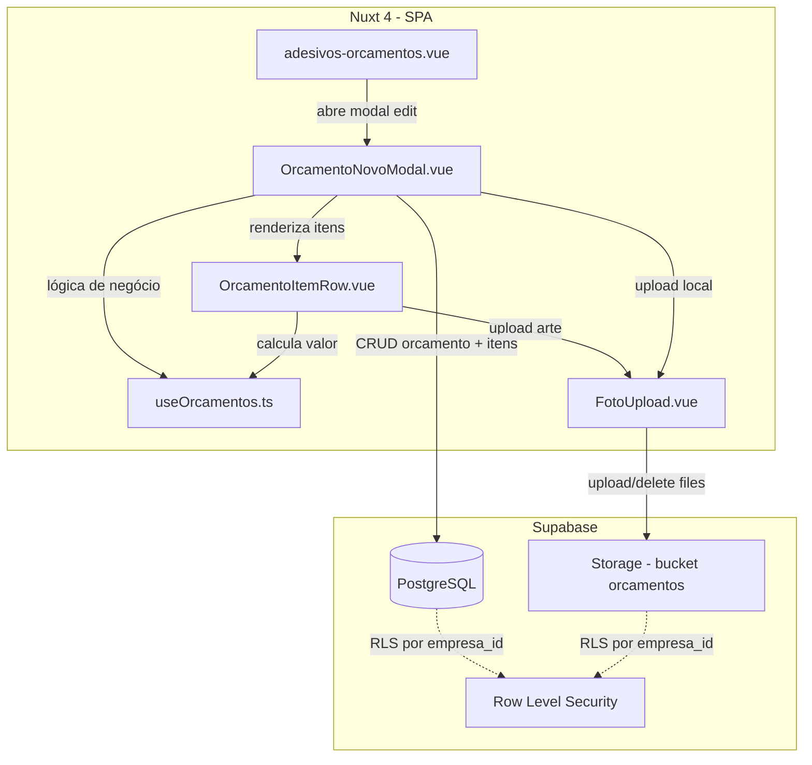

# Design Document: Edição de Orçamento e Upload de Fotos

## Overview

Esta feature estende o módulo de Orçamentos de Adesivos com quatro capacidades principais:

1. **Edição de orçamentos existentes** — reutiliza o `OrcamentoNovoModal` em modo edição, com pré-preenchimento de dados e sincronização de itens (insert/update/delete)
2. **Override de preço por m² por item** — campo editável no `OrcamentoItemRow` que permite ao operador definir um preço personalizado sem alterar o cadastro do material
3. **Upload de foto do local de instalação** — vinculada ao orçamento, armazenada no Supabase Storage
4. **Upload de foto da arte do adesivo** — vinculada a cada item do orçamento, propagada para a Ordem de Serviço

A arquitetura segue os padrões já estabelecidos: composables para lógica de negócio, componentes Vue para UI, Supabase como backend (Postgres + Storage), e validação compartilhada entre front e banco via constraints.

## Architecture



### Decisões Arquiteturais

| Decisão | Rationale |
|---------|-----------|
| Reutilizar `OrcamentoNovoModal` com prop `mode` | Evita duplicação de template/lógica; o modal já contém toda a UI necessária |
| Novo componente `FotoUpload.vue` genérico | Reutilizável entre foto do local (modal) e foto da arte (item row), com props para mime types e tamanho máximo |
| Função `calcularDiffItens()` no composable | Lógica pura e testável para determinar quais itens inserir, atualizar ou deletar |
| Campo `preco_m2` no `ItemOrcamento` já existe | O tipo já possui a propriedade; basta torná-la editável no UI e persistir no banco |
| Bucket único `orcamentos` com subpastas | Organização por `{empresa_id}/{orcamento_id}/...` facilita RLS e limpeza |

## Components and Interfaces

### Componentes Modificados

#### `OrcamentoNovoModal.vue`

```typescript
// Nova prop para modo edição
interface Props {
  show: boolean
  clientes: Cliente[]
  materiais: Material[]
  mode?: 'create' | 'edit'               // novo
  orcamentoParaEditar?: OrcamentoCompleto // novo - dados para pré-preenchimento
}

interface OrcamentoCompleto {
  id: number
  numero_orcamento: string
  status: string
  cliente_id: number
  validade_dias: number
  prazo_estimado_dias: number | null
  valor_mao_obra: number
  desconto_percentual: number
  desconto_valor: number
  token_aprovacao: string | null
  foto_local_url: string | null          // novo
  itens: ItemOrcamentoCompleto[]
}

interface ItemOrcamentoCompleto extends ItemOrcamento {
  id: number                              // ID do item existente
  foto_arte_url: string | null           // novo
}

// Emits atualizados
interface Emits {
  (e: 'close'): void
  (e: 'created', data: any): void
  (e: 'updated', data: any): void        // novo
}
```

**Comportamento em modo edição:**
- Título muda para "Editar Orçamento" + número
- Form pré-preenchido com dados do `orcamentoParaEditar`
- Botão de ação muda para "Salvar Alterações"
- Ao confirmar: chama `atualizarOrcamento()` em vez de `salvarRascunho()`
- Campo de upload "Foto do Local de Instalação" exibido acima da lista de itens

#### `OrcamentoItemRow.vue`

```typescript
// Props atualizadas
interface Props {
  item: ItemOrcamento
  index: number
  materiais: Material[]
}

// ItemOrcamento já possui preco_m2 — agora será editável no template
// Novo campo foto_arte_url adicionado ao tipo
```

**Novos elementos no template:**
- Campo editável `R$/m²` visível quando `modalidade_preco === 'm2'`
- Badge/ícone de override quando `item.preco_m2 !== materialSelecionado.preco_m2`
- Componente `FotoUpload` para a arte do adesivo

### Novos Componentes

#### `FotoUpload.vue`

```typescript
interface Props {
  modelValue: string | null              // URL da foto existente
  label: string                          // "Foto do Local" ou "Arte do Adesivo"
  accept: string                         // "image/jpeg,image/png,image/webp" ou com ",application/pdf"
  maxSizeMb: number                      // 5 ou 10
  storagePath: string                    // path no bucket para upload
}

interface Emits {
  (e: 'update:modelValue', url: string | null): void
  (e: 'file-selected', file: File): void
  (e: 'file-removed'): void
  (e: 'error', msg: string): void
}
```

**Responsabilidades:**
- Validação client-side de tipo e tamanho
- Preview (thumbnail) para imagens; ícone para PDF
- Botões substituir/remover quando há foto existente
- Upload para Supabase Storage (no momento do save do orçamento)
- Exibição de loading durante upload

### Funções do Composable (`useOrcamentos.ts`)

```typescript
// Novas funções exportadas

/** Determina se um status permite edição */
function isStatusEditavel(status: string): boolean

/** Calcula diff entre itens originais e modificados */
interface DiffItens {
  inserir: ItemOrcamento[]
  atualizar: ItemOrcamentoCompleto[]
  deletar: number[]  // IDs dos itens removidos
}
function calcularDiffItens(
  originais: ItemOrcamentoCompleto[],
  atuais: ItemOrcamento[]
): DiffItens

/** Validação de arquivo para upload de foto */
interface ValidacaoArquivo {
  valido: boolean
  erro?: string
}
function validarArquivoUpload(
  file: { type: string; size: number },
  tiposAceitos: string[],
  tamanhoMaxBytes: number
): ValidacaoArquivo

/** Valida preço por m² */
function validarPrecoM2(valor: number | null | undefined): ValidacaoResult

/** Verifica se preço é override (diferente do padrão do material) */
function isPrecoOverride(precoItem: number, precoMaterial: number): boolean

/** Gera o storage path para foto do local */
function gerarPathFotoLocal(empresaId: number, orcamentoId: number, extensao: string): string

/** Gera o storage path para foto da arte */
function gerarPathFotoArte(empresaId: number, orcamentoId: number, itemId: string, extensao: string): string

/** Mapeia itens de orçamento para itens de OS (com foto_arte_url) */
function mapearItensParaOS(
  itensOrcamento: ItemOrcamentoCompleto[],
  ordemServicoId: number
): ItemOrdemServico[]
```

## Data Models

### Alterações no Banco de Dados

#### Tabela `orcamentos_adesivo` — novo campo

```sql
ALTER TABLE public.orcamentos_adesivo
  ADD COLUMN IF NOT EXISTS foto_local_url text;
```

#### Tabela `itens_orcamento` — novos campos

```sql
-- Campo preco_m2 já existe implicitamente via calcularValorItem
-- Precisamos adicioná-lo explicitamente com constraint
ALTER TABLE public.itens_orcamento
  ADD COLUMN IF NOT EXISTS preco_m2 numeric(10,2)
    CHECK (preco_m2 IS NULL OR preco_m2 BETWEEN 0.01 AND 9999.99);

ALTER TABLE public.itens_orcamento
  ADD COLUMN IF NOT EXISTS foto_arte_url text;
```

#### Tabela `itens_ordem_servico` — novo campo

```sql
ALTER TABLE public.itens_ordem_servico
  ADD COLUMN IF NOT EXISTS foto_arte_url text;
```

#### Bucket Storage `orcamentos`

```sql
INSERT INTO storage.buckets (id, name, public, file_size_limit, allowed_mime_types)
VALUES (
  'orcamentos',
  'orcamentos',
  true,
  10485760,  -- 10 MB (maior limite entre os dois tipos)
  ARRAY['image/jpeg', 'image/png', 'image/webp', 'application/pdf']
)
ON CONFLICT (id) DO NOTHING;
```

### Estrutura de Paths no Storage

```
orcamentos/
  {empresa_id}/
    {orcamento_id}/
      local-instalacao.{jpg|png|webp}
      itens/
        {item_id}/
          arte.{jpg|png|webp|pdf}
```

### TypeScript Types Atualizados

```typescript
// Extensão do ItemOrcamento existente
export interface ItemOrcamento {
  id?: number
  descricao: string
  material_id: number
  material_nome?: string
  largura_cm: number
  altura_cm: number
  quantidade: number
  modalidade_preco: 'm2' | 'unidade'
  preco_unitario?: number
  preco_m2?: number
  area_m2?: number
  valor_item: number
  foto_arte_url?: string | null          // NOVO
  foto_arte_file?: File | null           // NOVO - arquivo selecionado antes do upload
}

export interface OrcamentoCompleto {
  id: number
  numero_orcamento: string
  status: 'rascunho' | 'enviado' | 'aprovado' | 'rejeitado' | 'vencido'
  cliente_id: number
  validade_dias: number
  prazo_estimado_dias: number | null
  valor_mao_obra_global: number
  desconto_percentual: number
  desconto_valor: number
  valor_total: number
  token_aprovacao: string | null
  foto_local_url: string | null          // NOVO
  itens: ItemOrcamentoCompleto[]
}

export interface ItemOrcamentoCompleto extends ItemOrcamento {
  id: number
}
```

## Correctness Properties

*A property is a characteristic or behavior that should hold true across all valid executions of a system — essentially, a formal statement about what the system should do. Properties serve as the bridge between human-readable specifications and machine-verifiable correctness guarantees.*

### Property 1: Item Sync Diff Correctness

*For any* original list of items (each with a unique ID) and any modified list of items (where some have IDs from the original, some are new without IDs, and some original IDs are absent), `calcularDiffItens` SHALL produce:
- `inserir`: exactly the items without an existing ID
- `atualizar`: exactly the items whose ID exists in the original list
- `deletar`: exactly the IDs present in the original but absent in the modified list

And the union of inserir IDs (empty), atualizar IDs, and deletar IDs SHALL equal exactly the set of original IDs.

**Validates: Requirements 1.6**

### Property 2: Edit Button Status Guard

*For any* orcamento status string, `isStatusEditavel(status)` SHALL return `true` if and only if `status` is one of `['rascunho', 'enviado']`.

**Validates: Requirements 1.7**

### Property 3: Price Calculation with Override

*For any* item with `modalidade_preco = 'm2'`, valid dimensions (`largura_cm` ∈ [0.1, 9999.9], `altura_cm` ∈ [0.1, 9999.9], `quantidade` ∈ [1, 99999]) and valid `preco_m2` ∈ [0.01, 9999.99], `calcularValorItem(item)` SHALL return a value equal to `(largura_cm × altura_cm × quantidade) / 10000 × preco_m2`.

**Validates: Requirements 2.2**

### Property 4: Price Override Validation Range

*For any* numeric value `v`, `validarPrecoM2(v)` SHALL return `{ valid: true }` if and only if `v >= 0.01` AND `v <= 9999.99`.

**Validates: Requirements 2.4**

### Property 5: Override Indicator Correctness

*For any* two numeric values `precoItem` and `precoMaterial`, `isPrecoOverride(precoItem, precoMaterial)` SHALL return `true` if and only if `precoItem !== precoMaterial`.

**Validates: Requirements 2.6**

### Property 6: File Upload Validation

*For any* file descriptor `{ type, size }`, a list of accepted mime types, and a maximum size in bytes, `validarArquivoUpload(file, tipos, maxSize)` SHALL return `{ valido: true }` if and only if `file.type` is included in `tipos` AND `file.size <= maxSize`.

**Validates: Requirements 3.2, 4.2**

### Property 7: Art Photo Propagation to OS

*For any* list of `ItemOrcamentoCompleto` with `foto_arte_url` values (some null, some with URLs), `mapearItensParaOS(itens, osId)` SHALL produce OS items where each OS item's `foto_arte_url` equals the corresponding orcamento item's `foto_arte_url`.

**Validates: Requirements 5.5**

## Error Handling

### Validação Client-Side

| Cenário | Comportamento |
|---------|---------------|
| Arquivo com formato inválido | Mensagem inline: "Formato não suportado. Use JPEG, PNG ou WebP" (ou + PDF para arte) |
| Arquivo excede tamanho máximo | Mensagem inline: "Arquivo muito grande. Máximo: 5 MB" (ou 10 MB) |
| Preço m² fora do range | Mensagem inline: "Preço deve estar entre R$ 0,01 e R$ 9.999,99" |
| Edição de orçamento não-editável | Botão desabilitado + tooltip explicativo |
| Formulário inválido ao salvar | Bloco de erros no topo do modal (padrão existente) |

### Erros de Upload (Storage)

| Cenário | Comportamento |
|---------|---------------|
| Falha de rede durante upload | Toast de erro + permite retry; não salva URL parcial |
| Bucket não encontrado | Log no console + toast genérico ao usuário |
| RLS block (empresa errada) | Toast: "Sem permissão para upload" |
| Upload OK mas save do orcamento falha | Cleanup: deleta arquivo uploadado do Storage |

### Erros de Persistência (Database)

| Cenário | Comportamento |
|---------|---------------|
| Falha ao atualizar orcamento | Mensagem no formulário; não altera itens |
| Falha ao sincronizar itens | Rollback: reverte update do orcamento se possível |
| Constraint violation (preco_m2 fora do range) | Mensagem inline no campo específico |
| Conflito de edição concorrente | Não implementado nesta versão (single-user assumption) |

### Estratégia de Cleanup

Quando o upload de fotos é feito antes do save do orçamento (staged upload):
1. Fotos são uploadadas ao selecionar arquivo (para feedback imediato de preview)
2. Se o usuário cancelar o modal, fotos staged são deletadas do Storage
3. Se o save falhar, fotos já uploadadas são deletadas (best-effort cleanup)

## Testing Strategy

### Abordagem Dual: Unit + Property Tests

O projeto já utiliza **Vitest** + **fast-check** (ambos no `package.json`). A estratégia de testes segue o padrão existente em `tests/unit/`.

### Property-Based Tests (fast-check)

Cada property test roda no mínimo **100 iterações** com inputs gerados aleatoriamente.

| Property | Função Testada | Tag |
|----------|---------------|-----|
| 1: Item Sync Diff | `calcularDiffItens()` | Feature: edicao-orcamento-fotos, Property 1: item sync diff produces correct insert/update/delete sets |
| 2: Status Guard | `isStatusEditavel()` | Feature: edicao-orcamento-fotos, Property 2: edit enabled iff status editable |
| 3: Price Calc Override | `calcularValorItem()` | Feature: edicao-orcamento-fotos, Property 3: price calculation with override matches formula |
| 4: Price Validation | `validarPrecoM2()` | Feature: edicao-orcamento-fotos, Property 4: validation accepts iff in range |
| 5: Override Indicator | `isPrecoOverride()` | Feature: edicao-orcamento-fotos, Property 5: indicator true iff values differ |
| 6: File Validation | `validarArquivoUpload()` | Feature: edicao-orcamento-fotos, Property 6: file valid iff type accepted and size within limit |
| 7: Art Photo to OS | `mapearItensParaOS()` | Feature: edicao-orcamento-fotos, Property 7: foto_arte_url propagated to OS items |

### Unit Tests (Example-Based)

| Cenário | Tipo |
|---------|------|
| Modal em modo edit exibe título "Editar Orçamento" + número | Example |
| Seleção de material atualiza campo preco_m2 com padrão | Example |
| Status "aprovado" desabilita botão editar | Example |
| Edição de orcamento "enviado" preserva token_aprovacao | Example |
| Preview de imagem exibido após seleção de arquivo válido | Example |
| Rejeição de arquivo .gif (formato inválido) | Edge case |
| Rejeição de arquivo com 6 MB para foto local (> 5 MB) | Edge case |

### Integration Tests

| Cenário | Escopo |
|---------|--------|
| Upload de foto para Supabase Storage com path correto | Storage |
| Remoção de foto deleta arquivo do Storage | Storage |
| Update de orcamento + sync de itens em uma transação | Database |
| RLS impede upload por empresa diferente | Security |

### Configuração

```typescript
// Exemplo de property test com fast-check
import fc from 'fast-check'
import { describe, it, expect } from 'vitest'

describe('Property Tests - edicao-orcamento-fotos', () => {
  it('Property 1: item sync diff produces correct sets', () => {
    fc.assert(
      fc.property(
        // generators...
        fc.array(fc.record({ id: fc.nat(), /* ... */ })),
        (originais, modificados) => {
          const diff = calcularDiffItens(originais, modificados)
          // assertions...
        }
      ),
      { numRuns: 100 }
    )
  })
})
```
