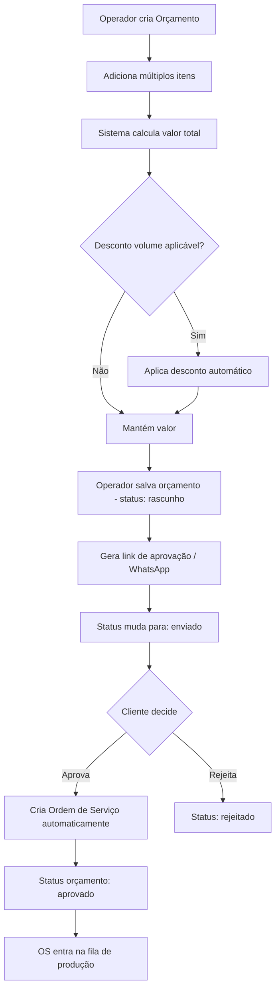
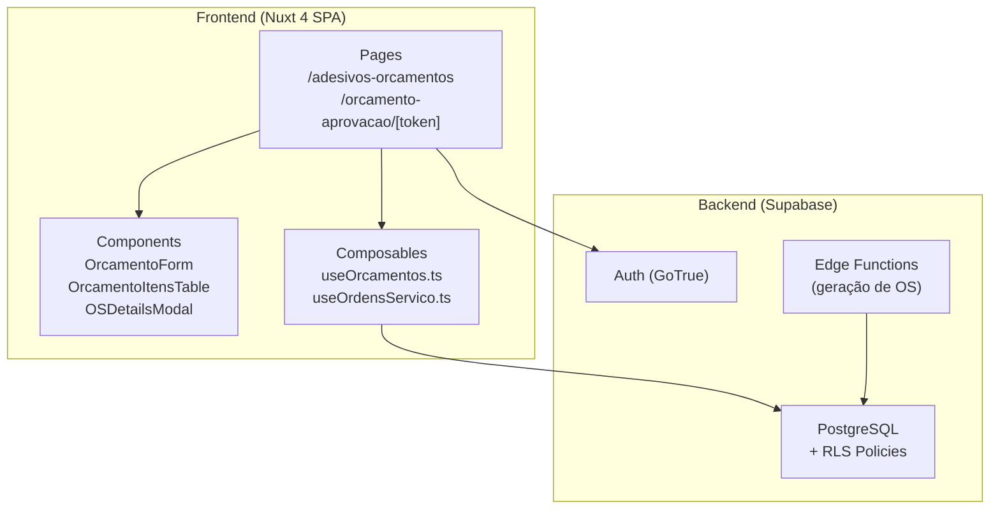
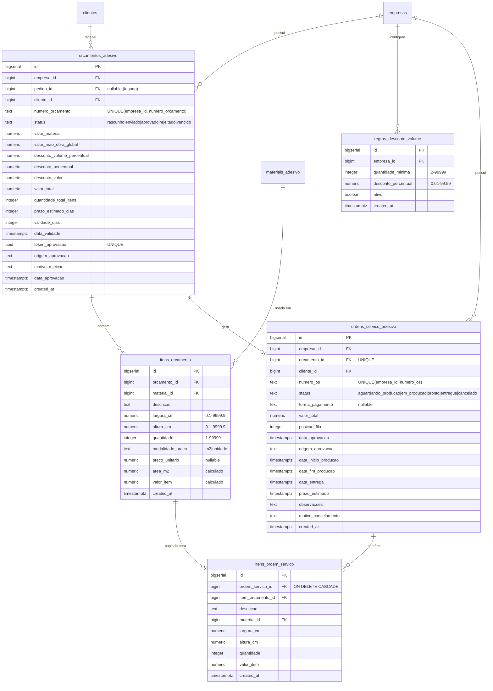

# Design Document: Orçamento → Ordem de Serviço

## Overview

Este design detalha a reformulação do fluxo de orçamentos no módulo de Adesivos. O fluxo atual é invertido (pedido primeiro → orçamento depois). O novo fluxo posiciona o **Orçamento como entidade primária** com múltiplos itens, e ao ser aprovado, gera automaticamente uma **Ordem de Serviço (OS)**.

### Decisões-Chave de Design

1. **Orçamento independente de pedido**: O campo `pedido_id` na tabela `orcamentos_adesivo` torna-se nullable. Novos orçamentos não criam pedidos.
2. **Multi-item**: Nova tabela `itens_orcamento` para composição de múltiplos produtos por orçamento.
3. **OS como derivação**: A tabela `ordens_servico_adesivo` é criada na aprovação, copiando itens do orçamento.
4. **Reutilização de infraestrutura**: Token de aprovação, regras de desconto por volume e página pública já existem e são adaptados.
5. **Coexistência com fluxo legado**: Orçamentos antigos (vinculados a pedidos) permanecem acessíveis com indicação visual "legado".

### Fluxo Principal



## Architecture

### Camadas da Aplicação



### Padrão de Arquitetura

- **Client-side**: Toda lógica de UI e cálculos em tempo real no composable `useOrcamentos.ts` (expandido)
- **Data layer**: Supabase client direto, com RLS por `empresa_id`
- **Geração de OS**: Pode ser feito client-side (transação via Supabase RPC) ou via Database Function/Trigger para garantir atomicidade
- **Página pública**: Rota sem autenticação (`/orcamento-aprovacao/[token]`) com policy `anon` no Supabase

### Decisão: Geração de OS via RPC

A criação da Ordem de Serviço na aprovação será implementada como uma **Supabase Database Function (RPC)** `gerar_ordem_servico(p_orcamento_id)` que:
1. Valida que o orçamento existe e está "enviado"
2. Cria a OS com dados do orçamento
3. Copia itens do orçamento para itens da OS
4. Atualiza o status do orçamento para "aprovado"
5. Calcula `posicao_fila` como `MAX(posicao_fila) + 1` da empresa

**Justificativa**: Garante atomicidade (tudo ou nada), funciona tanto para aprovação interna quanto externa, e simplifica o código do frontend.

## Components and Interfaces

### Composables

#### `useOrcamentos.ts` (extensão)

O composable existente será estendido com as novas funções para suportar multi-itens:

```typescript
// Novas funções a adicionar ao composable existente

interface ItemOrcamento {
  id?: number
  descricao: string
  material_id: number
  material_nome?: string
  largura_cm: number
  altura_cm: number
  quantidade: number
  modalidade_preco: 'm2' | 'unidade'
  preco_unitario?: number
  preco_m2?: number
  area_m2?: number
  valor_item: number
}

// Calcula area_m2 de um item
function calcularAreaItem(largura_cm: number, altura_cm: number, quantidade: number): number

// Calcula valor de um item baseado na modalidade
function calcularValorItem(item: ItemOrcamento): number

// Calcula total de todos os itens
function calcularTotalItens(itens: ItemOrcamento[]): number

// Calcula quantidade total (soma das quantidades individuais)
function calcularQuantidadeTotal(itens: ItemOrcamento[]): number

// Gera número sequencial ORC-N
function gerarNumeroOrcamento(ultimoNumero: number): string

// Valida orçamento completo antes de salvar
function validarOrcamento(dados: OrcamentoFormData): ValidacaoResult

// Compor mensagem WhatsApp para multi-itens
function comporMensagemWhatsAppMultiItens(dados: {
  nomeCliente: string
  quantidadeItens: number
  descricaoResumida: string
  valorTotal: number
  validade: string
  linkAprovacao: string
}): string

// Classificação de status com novos valores
function classificarStatusOrcamentoV2(
  status: StatusOrcamentoV2,
  dataValidade: Date | string,
  now?: Date
): StatusOrcamentoDisplay
```

#### `useOrdensServico.ts` (novo)

```typescript
interface OrdemServico {
  id: number
  empresa_id: number
  orcamento_id: number
  cliente_id: number
  numero_os: string
  status: StatusOS
  forma_pagamento: FormaPagamento | null
  valor_total: number
  posicao_fila: number
  data_aprovacao: string
  origem_aprovacao: 'interno' | 'link_externo'
  prazo_estimado: string | null
  observacoes: string | null
}

type StatusOS = 'aguardando_producao' | 'em_producao' | 'pronto' | 'entregue' | 'cancelado'
type FormaPagamento = 'dinheiro' | 'pix' | 'cartao' | 'boleto' | 'parcelado'

// Transições válidas de status
function validarTransicaoOS(atual: StatusOS, novo: StatusOS): boolean

// Gera número sequencial OS-N
function gerarNumeroOS(ultimoNumero: number): string
```

### Vue Components

#### Novos Components

| Component | Responsabilidade |
|-----------|-----------------|
| `OrcamentoNovoModal.vue` | Modal/form de criação de orçamento multi-itens |
| `OrcamentoItemRow.vue` | Linha de item no formulário (material, dimensões, qtd, valor) |
| `OrcamentoResumoValores.vue` | Card com subtotal, descontos, mão de obra e total |
| `OSIndicadorBadge.vue` | Badge na listagem indicando OS vinculada + status |
| `OSDetalhesModal.vue` | Modal com detalhes da OS (itens, status, fila) |
| `OSStatusTransition.vue` | Botões de transição de status da OS |

#### Componentes Existentes Adaptados

| Component | Alteração |
|-----------|-----------|
| `OrcamentoFormPrecificacao.vue` | Refatorar para funcionar por item individual |
| `OrcamentoFormDesconto.vue` | Adaptar para desconto sobre total de múltiplos itens |
| `DescontoVolumeConfigModal.vue` | Sem alteração (já funciona) |

### Páginas

| Rota | Componente | Autenticação |
|------|-----------|--------------|
| `/adesivos-orcamentos` | `adesivos-orcamentos.vue` | Authenticated |
| `/orcamento-aprovacao/[token]` | `[token].vue` | Public (anon) |

## Data Models

### Diagrama ER



### Alterações na Tabela Existente `orcamentos_adesivo`

```sql
ALTER TABLE public.orcamentos_adesivo
  ALTER COLUMN pedido_id DROP NOT NULL,
  ADD COLUMN IF NOT EXISTS cliente_id bigint REFERENCES public.clientes(id),
  ADD COLUMN IF NOT EXISTS numero_orcamento text,
  ADD COLUMN IF NOT EXISTS status text DEFAULT 'rascunho'
    CHECK (status IN ('rascunho', 'enviado', 'aprovado', 'rejeitado', 'vencido')),
  ADD COLUMN IF NOT EXISTS valor_mao_obra_global numeric(12,2) DEFAULT 0,
  ADD COLUMN IF NOT EXISTS quantidade_total_itens integer DEFAULT 0,
  ADD COLUMN IF NOT EXISTS motivo_rejeicao text,
  ADD COLUMN IF NOT EXISTS data_aprovacao timestamptz;

-- Unique constraint por empresa
ALTER TABLE public.orcamentos_adesivo
  ADD CONSTRAINT uq_orcamento_numero_empresa
  UNIQUE (empresa_id, numero_orcamento);
```

### RLS Policies (Novas Tabelas)

```sql
-- itens_orcamento: acesso via join com orcamentos_adesivo.empresa_id
ALTER TABLE public.itens_orcamento ENABLE ROW LEVEL SECURITY;

CREATE POLICY "itens_orcamento_tenant" ON public.itens_orcamento
  FOR ALL TO authenticated
  USING (orcamento_id IN (
    SELECT id FROM public.orcamentos_adesivo
    WHERE empresa_id IN (SELECT empresa_id FROM public.profiles WHERE id = auth.uid())
  ));

-- Acesso público (anon) para página de aprovação
CREATE POLICY "itens_orcamento_public_token" ON public.itens_orcamento
  FOR SELECT TO anon
  USING (orcamento_id IN (
    SELECT id FROM public.orcamentos_adesivo WHERE token_aprovacao IS NOT NULL
  ));

-- ordens_servico_adesivo: tenant isolation
ALTER TABLE public.ordens_servico_adesivo ENABLE ROW LEVEL SECURITY;

CREATE POLICY "ordens_servico_tenant" ON public.ordens_servico_adesivo
  FOR ALL TO authenticated
  USING (empresa_id IN (SELECT empresa_id FROM public.profiles WHERE id = auth.uid()));

-- itens_ordem_servico: acesso via join
ALTER TABLE public.itens_ordem_servico ENABLE ROW LEVEL SECURITY;

CREATE POLICY "itens_os_tenant" ON public.itens_ordem_servico
  FOR ALL TO authenticated
  USING (ordem_servico_id IN (
    SELECT id FROM public.ordens_servico_adesivo
    WHERE empresa_id IN (SELECT empresa_id FROM public.profiles WHERE id = auth.uid())
  ));
```

### Database Function: Geração de OS

```sql
CREATE OR REPLACE FUNCTION public.gerar_ordem_servico(
  p_orcamento_id bigint,
  p_forma_pagamento text DEFAULT NULL,
  p_origem text DEFAULT 'interno'
)
RETURNS bigint
LANGUAGE plpgsql
SECURITY DEFINER
AS $$
DECLARE
  v_orc RECORD;
  v_os_id bigint;
  v_numero_os text;
  v_next_pos integer;
  v_next_num integer;
BEGIN
  -- 1. Buscar e validar orçamento
  SELECT * INTO v_orc FROM public.orcamentos_adesivo WHERE id = p_orcamento_id;
  IF NOT FOUND THEN RAISE EXCEPTION 'Orçamento não encontrado';
  END IF;
  IF v_orc.status NOT IN ('enviado', 'rascunho') THEN
    RAISE EXCEPTION 'Orçamento não está em status válido para aprovação';
  END IF;

  -- 2. Verificar se já existe OS vinculada
  IF EXISTS (SELECT 1 FROM public.ordens_servico_adesivo WHERE orcamento_id = p_orcamento_id) THEN
    RAISE EXCEPTION 'Ordem de Serviço já gerada para este orçamento';
  END IF;

  -- 3. Gerar número sequencial da OS
  SELECT COALESCE(MAX(CAST(REPLACE(numero_os, 'OS-', '') AS integer)), 0) + 1
  INTO v_next_num
  FROM public.ordens_servico_adesivo
  WHERE empresa_id = v_orc.empresa_id;

  v_numero_os := 'OS-' || v_next_num;

  -- 4. Calcular posição na fila
  SELECT COALESCE(MAX(posicao_fila), 0) + 1
  INTO v_next_pos
  FROM public.ordens_servico_adesivo
  WHERE empresa_id = v_orc.empresa_id
    AND status IN ('aguardando_producao', 'em_producao');

  -- 5. Criar Ordem de Serviço
  INSERT INTO public.ordens_servico_adesivo (
    empresa_id, orcamento_id, cliente_id, numero_os, status,
    forma_pagamento, valor_total, posicao_fila, data_aprovacao,
    origem_aprovacao, prazo_estimado
  ) VALUES (
    v_orc.empresa_id, p_orcamento_id, v_orc.cliente_id, v_numero_os,
    'aguardando_producao', p_forma_pagamento, v_orc.valor_total,
    v_next_pos, now(), p_origem,
    CASE WHEN v_orc.prazo_estimado_dias IS NOT NULL
      THEN now() + (v_orc.prazo_estimado_dias || ' days')::interval
      ELSE NULL
    END
  ) RETURNING id INTO v_os_id;

  -- 6. Copiar itens do orçamento para OS
  INSERT INTO public.itens_ordem_servico (
    ordem_servico_id, item_orcamento_id, descricao, material_id,
    largura_cm, altura_cm, quantidade, valor_item
  )
  SELECT v_os_id, id, descricao, material_id,
         largura_cm, altura_cm, quantidade, valor_item
  FROM public.itens_orcamento
  WHERE orcamento_id = p_orcamento_id;

  -- 7. Atualizar status do orçamento
  UPDATE public.orcamentos_adesivo
  SET status = 'aprovado',
      data_aprovacao = now(),
      origem_aprovacao = p_origem
  WHERE id = p_orcamento_id;

  RETURN v_os_id;
END;
$$;
```

## Correctness Properties

*A property is a characteristic or behavior that should hold true across all valid executions of a system — essentially, a formal statement about what the system should do. Properties serve as the bridge between human-readable specifications and machine-verifiable correctness guarantees.*

### Property 1: Cálculo de valor do item por m²

*For any* item com modalidade "m2", largura_cm > 0, altura_cm > 0, quantidade > 0 e preco_m2 > 0, o valor calculado do item SHALL ser igual a `(largura_cm × altura_cm × quantidade) / 10000 × preco_m2`.

**Validates: Requirements 1.3**

### Property 2: Cálculo de valor do item por unidade

*For any* item com modalidade "unidade", preco_unitario entre 0.01 e 99999.99 e quantidade entre 1 e 99999, o valor calculado do item SHALL ser igual a `preco_unitario × quantidade`.

**Validates: Requirements 1.4**

### Property 3: Valor total do orçamento é soma dos itens + mão de obra - descontos

*For any* orçamento com N itens válidos (N ≥ 1), valor de mão de obra ≥ 0, desconto volume ≥ 0, desconto manual ≥ 0, o valor total SHALL ser igual a `soma_valores_itens + mao_obra - desconto_volume - desconto_manual` e o resultado SHALL ser > 0.

**Validates: Requirements 1.5**

### Property 4: Seleção de desconto por volume escolhe a maior faixa atendida

*For any* conjunto de regras de desconto não sobrepostas e qualquer quantidade total ≥ 1, o desconto selecionado SHALL corresponder à regra com a maior `quantidade_minima` que seja ≤ à quantidade total, ou null se nenhuma faixa atende.

**Validates: Requirements 7.3, 7.4**

### Property 5: Validação de orçamento rejeita itens inválidos

*For any* orçamento com zero itens, ou com algum item com campos obrigatórios ausentes, ou com valor total ≤ 0, a validação SHALL retornar `valid: false` com os erros específicos.

**Validates: Requirements 1.6**

### Property 6: Mensagem WhatsApp respeita limite de 1000 caracteres

*For any* dados de orçamento (nome do cliente, itens, valor, link), a mensagem WhatsApp composta SHALL ter comprimento ≤ 1000 caracteres e SHALL conter o link de aprovação.

**Validates: Requirements 6.1, 6.2**

### Property 7: Link de aprovação contém token válido

*For any* base URL não-vazia e token UUID v4 válido, o link de aprovação composto SHALL seguir o formato `{base_url}/orcamento-aprovacao/{token}`.

**Validates: Requirements 5.2**

### Property 8: Detecção de sobreposição de faixas de desconto

*For any* lista de regras existentes e nova quantidade_minima, a detecção de sobreposição SHALL retornar `true` se e somente se já existir uma regra com a mesma quantidade_minima.

**Validates: Requirements 7.8**

### Property 9: Validação de regra de desconto

*For any* par (quantidade_minima, desconto_percentual), a validação SHALL aceitar se e somente se quantidade_minima é inteiro entre 2 e 99999 e desconto_percentual está entre 0.01 e 99.99.

**Validates: Requirements 7.1**

### Property 10: Transições de status da OS são válidas

*For any* status atual da OS, apenas as transições definidas (aguardando→em_producao, em_producao→pronto, pronto→entregue, qualquer→cancelado) SHALL ser aceitas. Transições inválidas SHALL ser rejeitadas.

**Validates: Requirements 9.3, 9.4**

### Property 11: Número de orçamento é sequencial e único por empresa

*For any* sequência de orçamentos criados para uma empresa, o número gerado SHALL seguir o formato "ORC-{N}" onde N é estritamente crescente e único dentro da empresa.

**Validates: Requirements 1.8**

### Property 12: Cálculo de KPIs é consistente com os dados

*For any* lista de orçamentos com status e datas, o KPI de pendentes SHALL contar apenas orçamentos "enviados" não vencidos, vencidos SHALL contar apenas "enviados" com data expirada, e a taxa de conversão SHALL ser (aprovados no mês / total do mês) × 100.

**Validates: Requirements 2.7**

### Property 13: Filtragem de orçamentos combina todos os critérios

*For any* conjunto de orçamentos e combinação de filtros (data, status, nome), o resultado SHALL incluir apenas orçamentos que atendam a TODOS os critérios simultaneamente.

**Validates: Requirements 2.4**

## Error Handling

### Estratégias por Camada

| Cenário | Tratamento | UX |
|---------|------------|-----|
| Falha ao salvar orçamento | Retry automático (1x), depois mensagem de erro | Toast com botão "Tentar novamente" |
| Token de aprovação inválido | Página de erro estática | Mensagem "Orçamento não encontrado" |
| Orçamento já aprovado | Página informativa | Mostra status atual sem ações |
| Orçamento vencido | Página informativa | Mostra data de expiração |
| Falha na geração de OS (RPC) | Exception do Postgres | Toast de erro + log no console |
| Violação de UNIQUE (numero_orcamento) | Retry com novo número | Transparente ao usuário |
| Validação de campos falha | Erros inline no formulário | Highlight vermelho + mensagem |
| RLS bloqueia acesso | 403 / rows empty | Redirecionamento ou mensagem |
| Regra desconto sobreposta | Validação client + constraint DB | Mensagem específica de sobreposição |

### Validações Client-Side

- Todos os campos obrigatórios validados antes do submit
- Fórmulas de cálculo validadas em tempo real
- Limites de range (dimensões, quantidade, preço) validados no input
- Feedback visual imediato (bordas vermelhas, mensagens de erro)

### Validações Server-Side (Supabase)

- CHECK constraints nas tabelas para ranges válidos
- UNIQUE constraints para numeração
- RLS para isolamento de tenant
- Database function com RAISE EXCEPTION para regras de negócio

## Testing Strategy

### Abordagem Dual: Testes Unitários + Property-Based

#### Property-Based Tests (fast-check + Vitest)

Biblioteca: `fast-check` (já instalada no projeto)
Configuração: mínimo 100 iterações por propriedade.

Cada propriedade identificada na seção Correctness Properties será implementada como um teste PBT individual. Os testes cobrem:
- Cálculos de valor (m², unidade, total, descontos)
- Seleção de regras de desconto por volume
- Validações de dados (orçamento, regras, telefone)
- Composição de mensagens e links
- Classificação de status
- Transições de status de OS
- Geração de números sequenciais
- KPIs e filtragem

Tag format: **Feature: orcamento-ordem-servico, Property {number}: {property_text}**

#### Testes Unitários (Vitest)

Cenários específicos e edge cases:
- Aprovação via link com token vencido
- Rejeição com motivo (max 500 chars)
- Operador sem telefone do cliente (campo manual)
- Orçamento legado (com pedido_id) na listagem
- Transições de status inválidas retornam erro
- Paginação (exatamente 20 itens por página)

#### Testes de Integração

- Fluxo completo: criar orçamento → gerar link → aprovar → verificar OS criada
- RPC `gerar_ordem_servico`: idempotência (rejeita segunda chamada)
- RLS: usuário de empresa A não vê dados de empresa B
- Acesso anon: token válido retorna dados, token inválido retorna vazio

### Estrutura de Arquivos de Teste

```
tests/
  unit/
    useOrcamentos.spec.ts         (existente, será expandido)
    useOrcamentos.pbt.spec.ts     (novo - property-based tests)
    useOrdensServico.spec.ts      (novo - unit tests)
    useOrdensServico.pbt.spec.ts  (novo - property-based tests)
```
