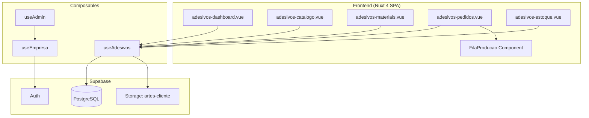
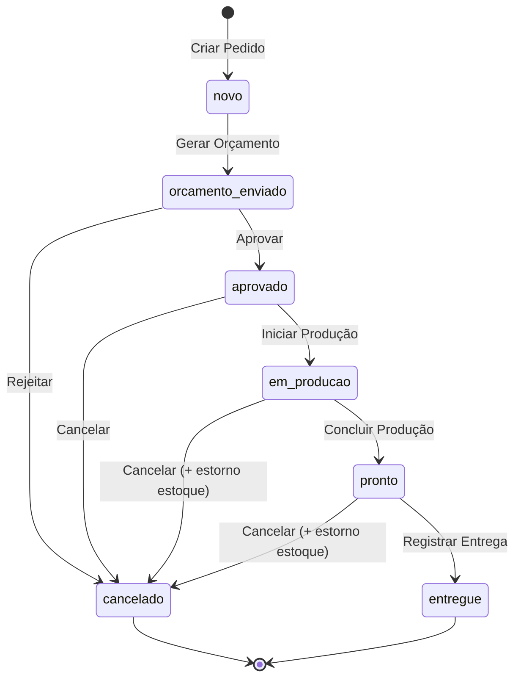
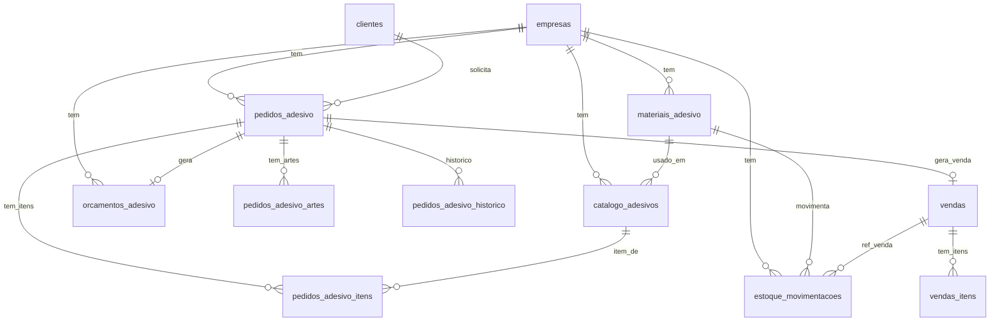

# Design Document: Sistema de Adesivos

## Overview

O módulo Sistema de Adesivos adiciona ao sistema multi-tenant existente (Nuxt 4 + Supabase) capacidade completa de gestão de uma empresa de adesivos personalizados. O módulo suporta dois fluxos de venda simultâneos:

1. **Sob Encomenda** — Cliente solicita arte/medida → Operador cria pedido → Gera orçamento → Cliente aprova → Produção → Entrega
2. **Catálogo / Venda Direta** — Operador seleciona produtos prontos → Registra venda imediata

O módulo segue rigorosamente os padrões arquiteturais existentes: single-page Vue com script setup, queries diretas ao Supabase filtradas por `empresa_id`, modais inline via Teleport, e componentes AppButton/AppInput.

### Decisões Arquiteturais Chave

| Decisão | Justificativa |
|---------|---------------|
| Páginas separadas por domínio (adesivos-catalogo, adesivos-materiais, adesivos-pedidos, adesivos-estoque, adesivos-dashboard) | Evita páginas com milhares de linhas; mantém coesão funcional |
| Tabelas novas com `empresa_id` FK + RLS | Padrão multi-tenant do sistema |
| Supabase Storage bucket `artes-cliente` | Upload de artes com policies por empresa |
| Reuso da tabela `vendas` + `vendas_itens` existente | Integração financeira nativa com o módulo vendas |
| Campo `forma_pagamento` adicionado à tabela `vendas` | Requisito de rastreio de forma de pagamento na aprovação/venda |
| Status machine para pedidos | Controle explícito de transições válidas via check constraint |

---

## Architecture

### High-Level Architecture



### Low-Level: Fluxo de Estados do Pedido



### Navegação no Sistema

As páginas do módulo serão adicionadas ao AppSidebar sob uma seção "Adesivos" com os links:
- Dashboard → `/adesivos-dashboard`
- Pedidos → `/adesivos-pedidos`
- Catálogo → `/adesivos-catalogo`
- Materiais → `/adesivos-materiais`
- Estoque → `/adesivos-estoque`

---

## Components and Interfaces

### Pages

| Página | Responsabilidade |
|--------|-----------------|
| `adesivos-dashboard.vue` | KPIs, alertas de estoque, próximos pedidos da fila |
| `adesivos-pedidos.vue` | CRUD de pedidos (encomenda + catálogo), fila de produção, orçamento, aprovação, entrega, cancelamento, histórico |
| `adesivos-catalogo.vue` | CRUD de produtos do catálogo com upload de imagem |
| `adesivos-materiais.vue` | CRUD de materiais com preço/m² |
| `adesivos-estoque.vue` | Entradas de estoque, saldo atual, histórico de movimentações |

### Composable: `useAdesivos()`

Composable auxiliar opcional para lógica compartilhada (cálculo de área, formatação de status). Cada página mantém sua lógica de fetch e state inline (padrão vendas.vue).

```typescript
// app/composables/useAdesivos.ts
export function useAdesivos() {
  /** Calcula área em m² a partir de largura (cm), altura (cm) e quantidade */
  function calcularArea(larguraCm: number, alturaCm: number, quantidade: number): number {
    return (larguraCm * alturaCm * quantidade) / 10000
  }

  /** Labels de status para exibição */
  const statusLabels: Record<string, string> = {
    novo: 'Novo',
    orcamento_enviado: 'Orçamento Enviado',
    aprovado: 'Aprovado',
    em_producao: 'Em Produção',
    pronto: 'Pronto',
    entregue: 'Entregue',
    cancelado: 'Cancelado',
  }

  /** Cores de badge por status */
  const statusColors: Record<string, string> = {
    novo: 'bg-blue-100 text-blue-700',
    orcamento_enviado: 'bg-yellow-100 text-yellow-700',
    aprovado: 'bg-green-100 text-green-700',
    em_producao: 'bg-purple-100 text-purple-700',
    pronto: 'bg-teal-100 text-teal-700',
    entregue: 'bg-gray-100 text-gray-700',
    cancelado: 'bg-red-100 text-red-700',
  }

  /** Transições de status válidas */
  const transicoesValidas: Record<string, string[]> = {
    novo: ['orcamento_enviado', 'cancelado'],
    orcamento_enviado: ['aprovado', 'cancelado'],
    aprovado: ['em_producao', 'cancelado'],
    em_producao: ['pronto', 'cancelado'],
    pronto: ['entregue', 'cancelado'],
  }

  function podeTransitar(statusAtual: string, statusNovo: string): boolean {
    return transicoesValidas[statusAtual]?.includes(statusNovo) ?? false
  }

  return { calcularArea, statusLabels, statusColors, transicoesValidas, podeTransitar }
}
```

### Interface dos Formulários (Low-Level)

**Modal Novo Pedido Encomenda:**
- Select cliente (autocomplete da tabela `clientes`)
- Input descrição (textarea, max 500)
- Input largura (number, 0.1–9999.9)
- Input altura (number, 0.1–9999.9)
- Select material (somente ativos)
- Input quantidade (integer, 1–99999)
- Textarea observações (max 1000, opcional)
- Upload artes (max 5 arquivos, 20MB cada)
- Exibição automática: área calculada em m²

**Modal Gerar Orçamento:**
- Exibição: dados do pedido (read-only)
- Input mão de obra (R$, ≥ 0)
- Input desconto (% ou R$ fixo)
- Input validade (dias, 1–90)
- Exibição: valor calculado em tempo real
- Botão: Gerar PDF e Enviar

**Modal Venda Catálogo (POS):**
- Select cliente
- Lista de produtos com quantidade e subtotal
- Input desconto (% ou R$ fixo)
- Select forma de pagamento
- Exibição: total da venda
- Botão: Confirmar Venda

---

## Data Models

### Novas Tabelas

```sql
-- ─────────────────────────────────────────────
-- materiais_adesivo
-- ─────────────────────────────────────────────
CREATE TABLE public.materiais_adesivo (
  id bigserial PRIMARY KEY,
  empresa_id bigint NOT NULL REFERENCES public.empresas(id),
  nome text NOT NULL,
  descricao text,
  preco_m2 numeric(10,2) NOT NULL CHECK (preco_m2 BETWEEN 0.01 AND 99999.99),
  estoque_atual numeric(10,2) NOT NULL DEFAULT 0 CHECK (estoque_atual >= -99999.99 AND estoque_atual <= 99999.99),
  estoque_minimo numeric(10,2) NOT NULL DEFAULT 0,
  ativo boolean NOT NULL DEFAULT true,
  created_at timestamptz DEFAULT now(),
  UNIQUE(empresa_id, nome)
);

-- ─────────────────────────────────────────────
-- catalogo_adesivos
-- ─────────────────────────────────────────────
CREATE TABLE public.catalogo_adesivos (
  id bigserial PRIMARY KEY,
  empresa_id bigint NOT NULL REFERENCES public.empresas(id),
  nome text NOT NULL,
  descricao text,
  categoria text NOT NULL,
  material_id bigint NOT NULL REFERENCES public.materiais_adesivo(id),
  largura_cm numeric(6,1) NOT NULL CHECK (largura_cm BETWEEN 0.1 AND 500),
  altura_cm numeric(6,1) NOT NULL CHECK (altura_cm BETWEEN 0.1 AND 500),
  preco_venda numeric(10,2) NOT NULL CHECK (preco_venda BETWEEN 0.01 AND 999999.99),
  imagem_url text,
  ativo boolean NOT NULL DEFAULT true,
  created_at timestamptz DEFAULT now()
);

-- ─────────────────────────────────────────────
-- pedidos_adesivo
-- ─────────────────────────────────────────────
CREATE TABLE public.pedidos_adesivo (
  id bigserial PRIMARY KEY,
  empresa_id bigint NOT NULL REFERENCES public.empresas(id),
  cliente_id bigint NOT NULL REFERENCES public.clientes(id),
  tipo text NOT NULL DEFAULT 'encomenda' CHECK (tipo IN ('encomenda', 'catalogo')),
  descricao text NOT NULL,
  material_id bigint REFERENCES public.materiais_adesivo(id),
  largura_cm numeric(7,1) CHECK (largura_cm BETWEEN 0.1 AND 9999.9),
  altura_cm numeric(7,1) CHECK (altura_cm BETWEEN 0.1 AND 9999.9),
  quantidade integer NOT NULL DEFAULT 1 CHECK (quantidade BETWEEN 1 AND 99999),
  area_total_m2 numeric(12,4) GENERATED ALWAYS AS (
    CASE WHEN largura_cm IS NOT NULL AND altura_cm IS NOT NULL
      THEN (largura_cm * altura_cm * quantidade) / 10000.0
      ELSE NULL
    END
  ) STORED,
  observacoes text,
  status text NOT NULL DEFAULT 'novo' CHECK (
    status IN ('novo','orcamento_enviado','aprovado','em_producao','pronto','entregue','cancelado')
  ),
  forma_pagamento text CHECK (
    forma_pagamento IS NULL OR forma_pagamento IN ('dinheiro','pix','cartao','boleto','parcelado')
  ),
  motivo_cancelamento text,
  data_cancelamento timestamptz,
  venda_id bigint REFERENCES public.vendas(id),
  posicao_fila integer,
  data_entrada_fila timestamptz,
  data_inicio_producao timestamptz,
  data_fim_producao timestamptz,
  data_entrega timestamptz,
  prazo_estimado timestamptz,
  created_at timestamptz DEFAULT now()
);

-- ─────────────────────────────────────────────
-- pedidos_adesivo_itens (para pedidos tipo catálogo)
-- ─────────────────────────────────────────────
CREATE TABLE public.pedidos_adesivo_itens (
  id bigserial PRIMARY KEY,
  pedido_id bigint NOT NULL REFERENCES public.pedidos_adesivo(id) ON DELETE CASCADE,
  produto_id bigint NOT NULL REFERENCES public.catalogo_adesivos(id),
  quantidade integer NOT NULL DEFAULT 1 CHECK (quantidade BETWEEN 1 AND 9999),
  preco_unitario numeric(10,2) NOT NULL,
  valor_total numeric(12,2) GENERATED ALWAYS AS (quantidade::numeric * preco_unitario) STORED
);

-- ─────────────────────────────────────────────
-- orcamentos_adesivo
-- ─────────────────────────────────────────────
CREATE TABLE public.orcamentos_adesivo (
  id bigserial PRIMARY KEY,
  pedido_id bigint NOT NULL REFERENCES public.pedidos_adesivo(id),
  empresa_id bigint NOT NULL REFERENCES public.empresas(id),
  valor_material numeric(12,2) NOT NULL,
  valor_mao_obra numeric(12,2) NOT NULL DEFAULT 0 CHECK (valor_mao_obra >= 0),
  desconto_percentual numeric(5,2) DEFAULT 0 CHECK (desconto_percentual BETWEEN 0 AND 100),
  desconto_valor numeric(12,2) DEFAULT 0 CHECK (desconto_valor >= 0),
  valor_total numeric(12,2) NOT NULL CHECK (valor_total > 0),
  prazo_estimado_dias integer,
  validade_dias integer NOT NULL DEFAULT 7 CHECK (validade_dias BETWEEN 1 AND 90),
  data_criacao timestamptz DEFAULT now(),
  data_validade timestamptz NOT NULL,
  created_at timestamptz DEFAULT now()
);

-- ─────────────────────────────────────────────
-- pedidos_adesivo_artes (artes do cliente)
-- ─────────────────────────────────────────────
CREATE TABLE public.pedidos_adesivo_artes (
  id bigserial PRIMARY KEY,
  pedido_id bigint NOT NULL REFERENCES public.pedidos_adesivo(id) ON DELETE CASCADE,
  nome_arquivo text NOT NULL,
  url text NOT NULL,
  tamanho_bytes bigint,
  tipo_mime text,
  created_at timestamptz DEFAULT now()
);

-- ─────────────────────────────────────────────
-- estoque_movimentacoes
-- ─────────────────────────────────────────────
CREATE TABLE public.estoque_movimentacoes (
  id bigserial PRIMARY KEY,
  empresa_id bigint NOT NULL REFERENCES public.empresas(id),
  material_id bigint NOT NULL REFERENCES public.materiais_adesivo(id),
  tipo text NOT NULL CHECK (tipo IN ('entrada', 'saida')),
  quantidade_m2 numeric(10,2) NOT NULL CHECK (quantidade_m2 > 0),
  saldo_resultante numeric(10,2) NOT NULL,
  custo_compra numeric(10,2),
  referencia_pedido_id bigint REFERENCES public.pedidos_adesivo(id),
  referencia_venda_id bigint REFERENCES public.vendas(id),
  observacoes text,
  created_at timestamptz DEFAULT now()
);

-- ─────────────────────────────────────────────
-- pedidos_adesivo_historico (log de mudanças de status)
-- ─────────────────────────────────────────────
CREATE TABLE public.pedidos_adesivo_historico (
  id bigserial PRIMARY KEY,
  pedido_id bigint NOT NULL REFERENCES public.pedidos_adesivo(id) ON DELETE CASCADE,
  status_anterior text,
  status_novo text NOT NULL,
  data_mudanca timestamptz DEFAULT now(),
  observacao text
);
```

### Alteração em Tabela Existente

```sql
-- Adicionar forma_pagamento à tabela vendas (se não existir)
ALTER TABLE public.vendas
  ADD COLUMN IF NOT EXISTS forma_pagamento text
  CHECK (forma_pagamento IS NULL OR forma_pagamento IN ('dinheiro','pix','cartao','boleto','parcelado'));
```

### RLS Policies (padrão multi-tenant)

```sql
-- Exemplo para materiais_adesivo (mesmo padrão para todas as novas tabelas)
ALTER TABLE public.materiais_adesivo ENABLE ROW LEVEL SECURITY;

CREATE POLICY "materiais_adesivo_tenant" ON public.materiais_adesivo
  FOR ALL
  USING (empresa_id = (
    SELECT empresa_id FROM public.profiles WHERE id = auth.uid()
  ))
  WITH CHECK (empresa_id = (
    SELECT empresa_id FROM public.profiles WHERE id = auth.uid()
  ));
```

### Supabase Storage

```
Bucket: artes-cliente
  Path pattern: {empresa_id}/{pedido_id}/{filename}
  Max file size: 20MB
  Allowed MIME types: image/png, image/jpeg, application/pdf, image/svg+xml, application/postscript
```

### Diagrama ER (Low-Level)



---


## Correctness Properties

*A property is a characteristic or behavior that should hold true across all valid executions of a system — essentially, a formal statement about what the system should do. Properties serve as the bridge between human-readable specifications and machine-verifiable correctness guarantees.*

### Property 1: State Machine Transition Validity

*For any* pedido with a given `status`, only the transitions defined in the state machine are allowed. Specifically:
- `novo` → `orcamento_enviado`, `cancelado`
- `orcamento_enviado` → `aprovado`, `cancelado`
- `aprovado` → `em_producao`, `cancelado`
- `em_producao` → `pronto`, `cancelado`
- `pronto` → `entregue`, `cancelado`
- `entregue` → (nenhuma)
- `cancelado` → (nenhuma)

Any attempt to transition to a status not in the allowed set for the current status SHALL be rejected.

**Validates: Requirements 4.7, 5.1, 5.2, 5.5, 6.2, 6.3, 6.7, 6.8, 7.1, 7.3, 11.3**

### Property 2: Area Calculation Correctness

*For any* valid dimensions (largura_cm ∈ [0.1, 9999.9], altura_cm ∈ [0.1, 9999.9]) and quantity (∈ [1, 99999]), the calculated area in m² SHALL equal `(largura_cm × altura_cm × quantidade) / 10000`, with precision to 4 decimal places.

**Validates: Requirements 3.5**

### Property 3: Quote Value Calculation

*For any* valid area (> 0), material price per m² (∈ [0.01, 99999.99]), labor cost (≥ 0), and discount (percentage ∈ [0, 100] or fixed value ≥ 0), the quote total SHALL equal `(area × preco_m2 + mao_obra) - discount_applied`, AND the final value SHALL always be greater than zero.

**Validates: Requirements 4.1, 4.2**

### Property 4: Cart Total Calculation

*For any* set of cart items where each item has a price (> 0) and quantity (∈ [1, 9999]), the cart total SHALL equal the sum of `(preco_unitario × quantidade)` for all items. When a discount is applied (percentage or fixed), the final value SHALL remain greater than zero.

**Validates: Requirements 8.2, 8.4**

### Property 5: Stock Balance Invariant

*For any* material, at any point in time, the `estoque_atual` SHALL equal the sum of all `entrada` movements minus the sum of all `saida` movements for that material. Specifically:
- When production starts: stock decreases by `area_total_m2`
- When stock entry is registered: stock increases by `quantidade_m2`
- When a catalog sale is confirmed: stock decreases by the product areas sold
- When an order is cancelled from `em_producao` or `pronto`: stock increases by `area_total_m2` (reversal)

**Validates: Requirements 9.2, 9.4, 9.7, 11.2**

### Property 6: Active-Only Filtering

*For any* query that retrieves items for selection (materials for new orders, products for catalog sales, products for listing), items with `ativo = false` SHALL NOT appear in the results. Conversely, all items with `ativo = true` that match other filter criteria SHALL appear.

**Validates: Requirements 1.3, 2.3, 8.1, 8.6**

### Property 7: Production Queue Membership

*For any* set of pedidos, the production queue SHALL contain exactly those pedidos with `status` equal to `aprovado` or `em_producao`, belonging to the current empresa. No pedido with any other status SHALL appear in the queue.

**Validates: Requirements 6.1, 11.4**

### Property 8: Pagination Invariants

*For any* paginated list query with page size 20, each page SHALL contain at most 20 items. The items SHALL be ordered according to the specified sort criterion (alphabetical for catalogo/materiais, descending date for pedidos). The union of all pages SHALL equal the complete filtered dataset.

**Validates: Requirements 1.4, 12.1**

### Property 9: Search Result Correctness

*For any* search query of at least 3 characters, every result returned SHALL contain the search term (case-insensitive) in at least one of: client name, order description, or order number. No result that does not match in any of these fields SHALL be returned.

**Validates: Requirements 12.2**

### Property 10: Quote Expiry Detection

*For any* orçamento with `data_validade`, the system SHALL correctly classify it as expired when the current date/time exceeds `data_validade`, and as valid otherwise.

**Validates: Requirements 4.5, 5.4**

### Property 11: Urgency Classification

*For any* pedido in the production queue with a `prazo_estimado`, the system SHALL classify it as:
- "overdue" when current time > prazo_estimado
- "urgent" when prazo_estimado - current time < 24 hours
- "normal" otherwise

These classifications SHALL be mutually exclusive and exhaustive for pedidos with prazo defined.

**Validates: Requirements 6.5**

### Property 12: Material Name Uniqueness Per Tenant

*For any* empresa, attempting to create or rename a material to a name that already exists within the same empresa SHALL be rejected. Materials with the same name in different empresas SHALL be allowed.

**Validates: Requirements 2.2**

### Property 13: Delivery Idempotence

*For any* pedido that already has a `venda_id` set (delivery already registered), any subsequent attempt to register delivery SHALL be rejected. Only pedidos with `venda_id = NULL` and `status = 'pronto'` SHALL accept delivery registration.

**Validates: Requirements 7.4**

### Property 14: Input Validation Completeness

*For any* product, material, or order form submission:
- Fields exceeding maximum character limits SHALL be rejected
- Numeric fields outside their defined ranges SHALL be rejected
- Required fields that are empty or whitespace-only SHALL be rejected
- File uploads exceeding size limits or with invalid MIME types SHALL be rejected
- The system SHALL report ALL invalid fields (not just the first one found)

**Validates: Requirements 1.1, 1.6, 1.7, 2.1, 2.5, 3.1, 3.2, 3.3, 3.6, 4.6, 11.1**

### Property 15: Dashboard KPI Aggregation

*For any* set of pedidos belonging to an empresa, the dashboard KPIs SHALL correctly compute:
- Count of pedidos per status = count of pedidos with each status value
- Faturamento do mês = sum of valor_total of pedidos with status "entregue" and data_entrega in current month
- Quantidade entregues no mês = count of pedidos with status "entregue" and data_entrega in current month
- Valor médio = faturamento do mês ÷ quantidade entregues (or 0 if none)

**Validates: Requirements 10.1**

### Property 16: Low Stock Alert Correctness

*For any* material where `estoque_atual < estoque_minimo`, the system SHALL include it in the low-stock alert list. Materials where `estoque_atual >= estoque_minimo` SHALL NOT appear in the alert list.

**Validates: Requirements 9.5, 10.2**

---

## Error Handling

### Client-Side Error Handling

| Cenário | Comportamento |
|---------|---------------|
| Campos obrigatórios vazios | Mensagem inline em cada campo inválido, formulário não submete |
| Valores fora dos limites | Mensagem descritiva com o limite violado |
| Upload falha (rede/tamanho/formato) | Toast de erro com motivo específico, arquivo não adicionado à lista |
| PDF não gera | Toast de erro, status do pedido NÃO muda |
| Supabase query falha | Toast de erro genérico + console.error, botão "tentar novamente" quando aplicável |
| Sessão expirada | Redirect para login (middleware `auth.global.ts` existente) |
| Estoque insuficiente | Modal de confirmação (warning) com quantidades, permite prosseguir |
| Orçamento vencido | Modal de confirmação (info) alertando vencimento, permite prosseguir |
| Registro duplicado de entrega | Toast de erro "Entrega já registrada para este pedido" |
| Transição de status inválida | Toast de erro "Operação não permitida no status atual" |

### Estratégia de Loading States

- `loading` ref para cada operação assíncrona
- Botões desabilitados + spinner durante operação
- Skeleton placeholders na primeira carga da página
- Optimistic UI para reordenação da fila (revert em caso de erro)

### Validação em Camadas

1. **Frontend** — Validação imediata antes de enviar ao Supabase
2. **Database** — CHECK constraints como última barreira (ex: `status IN (...)`, ranges numéricos)
3. **RLS** — Isolamento de tenant automático

---

## Testing Strategy

### Property-Based Testing (PBT)

**Biblioteca:** [fast-check](https://github.com/dubzzz/fast-check) (JavaScript/TypeScript)

O sistema contém lógica pura suficiente para justificar PBT nos seguintes domínios:
- Máquina de estados (transições válidas/inválidas)
- Cálculos numéricos (área, orçamento, carrinho, estoque)
- Validação de entrada (formatos, limites, campos obrigatórios)
- Filtragem e busca (active-only, queue membership, search)
- Agregações (dashboard KPIs)

**Configuração:**
- Mínimo 100 iterações por property test
- Cada test referencia a propriedade do design: `// Feature: sistema-adesivos, Property N: <título>`
- fast-check integrado com Vitest

### Unit Tests (Example-Based)

Casos específicos e edge cases:
- Criação de pedido com status inicial correto
- Forma de pagamento obrigatória na aprovação/venda
- Dashboard exibe mensagem de erro e retry em falha
- Busca sem resultados exibe mensagem apropriada
- Associação correta de empresa_id em todas as entidades

### Integration Tests

Interações com Supabase (podem usar instância local via Docker):
- Upload de arte no Storage + vínculo ao pedido
- Entrega cria registro na tabela `vendas` + `vendas_itens`
- Reordenação da fila persistida corretamente
- RLS impede acesso cross-tenant
- PDF gerado contém dados corretos

### Estrutura de Testes

```
tests/
  unit/
    useAdesivos.spec.ts          — Composable (cálculos, status, validação)
    areaCalculo.spec.ts          — Cálculo de área
    orcamentoCalculo.spec.ts     — Cálculo de orçamento
    validacao.spec.ts            — Validação de formulários
  property/
    stateMachine.property.ts     — Property 1: transições de estado
    areaCalculo.property.ts      — Property 2: cálculo de área
    orcamento.property.ts        — Property 3: valor do orçamento
    carrinho.property.ts         — Property 4: total do carrinho
    estoque.property.ts          — Property 5: invariante de estoque
    filtragem.property.ts        — Property 6: filtragem ativo/inativo
    filaProducao.property.ts     — Property 7: membership da fila
    paginacao.property.ts        — Property 8: paginação
    busca.property.ts            — Property 9: busca
    expiracao.property.ts        — Property 10: detecção de vencimento
    urgencia.property.ts         — Property 11: classificação de urgência
    unicidade.property.ts        — Property 12: unicidade de nome
    idempotencia.property.ts     — Property 13: idempotência de entrega
    validacao.property.ts        — Property 14: validação de entrada
    dashboard.property.ts        — Property 15: KPIs do dashboard
    alertaEstoque.property.ts    — Property 16: alerta de estoque baixo
  integration/
    upload.integration.ts        — Upload de artes
    vendaIntegracao.integration.ts — Integração com tabela vendas
    pdfGeração.integration.ts    — Geração de PDF
```

### Execução

```bash
# Unit + Property tests (rápido, sem dependências externas)
npx vitest --run tests/unit tests/property

# Integration tests (requer Supabase local)
npx vitest --run tests/integration
```
