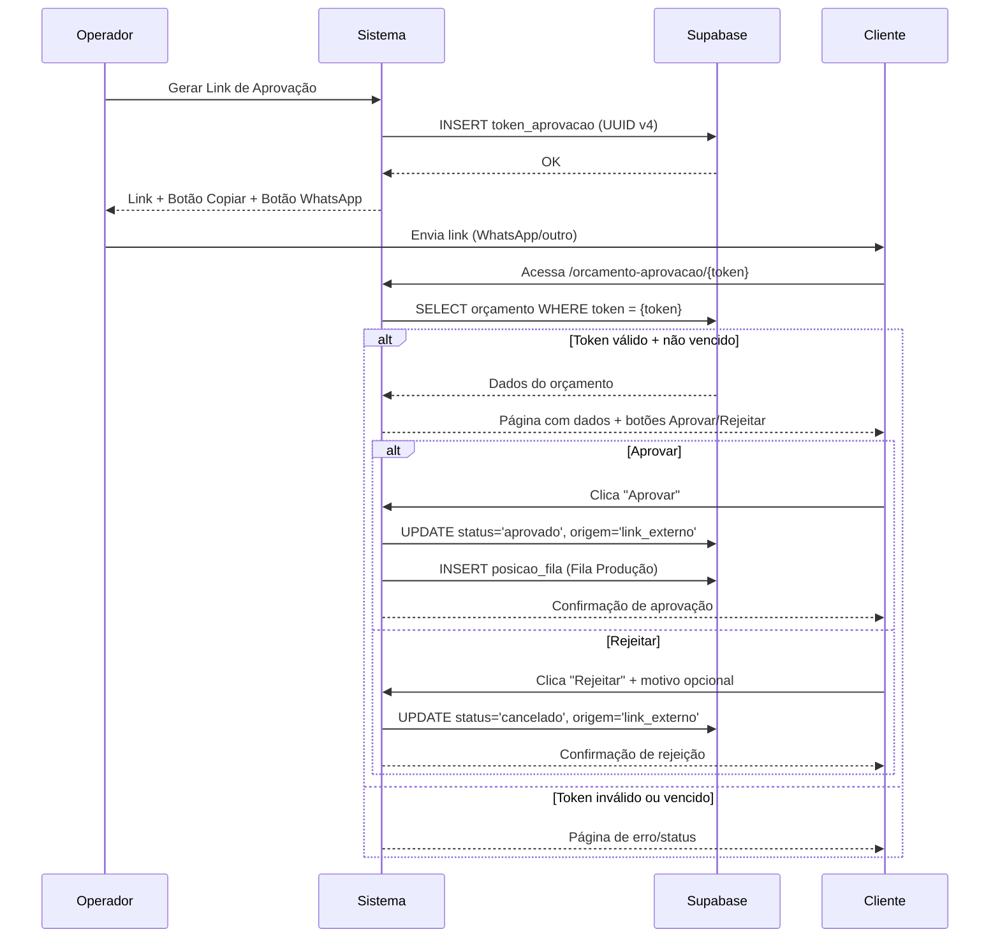
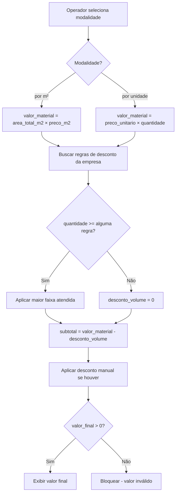
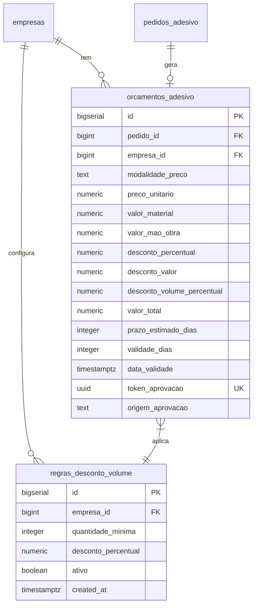

# Design Document: Tela de Orçamentos

## Overview

A Tela de Orçamentos (`/adesivos-orcamentos`) é uma página dedicada ao gerenciamento centralizado de orçamentos do módulo de adesivos. Ela estende o sistema existente com três capacidades novas:

1. **Cálculo por Unidade** — Precificação alternativa ao m² para pedidos com valor fixo por peça
2. **Desconto por Volume** — Regras configuráveis que aplicam desconto automático baseado na quantidade
3. **Aprovação Externa** — Link compartilhável + WhatsApp para o cliente aprovar sem login

A implementação segue os padrões do projeto: página Vue com `<script setup>`, queries diretas ao Supabase filtradas por `empresa_id` via RLS, composable `useAdesivos()` para lógica pura, e TailwindCSS para estilos.

### Decisões Arquiteturais

| Decisão | Justificativa |
|---------|---------------|
| Nova página `adesivos-orcamentos.vue` separada de `adesivos-pedidos.vue` | Evita sobrecarregar a página de pedidos (~1000+ LOC); responsabilidade distinta |
| Página pública `orcamento-aprovacao/[token].vue` sem layout auth | Cliente não precisa de conta no sistema |
| Tabela `regras_desconto_volume` independente | Permite CRUD de regras sem afetar orçamentos existentes |
| Extensão de `orcamentos_adesivo` (ALTER TABLE) | Reutiliza tabela existente adicionando campos necessários |
| Token UUID no banco (não JWT) | Simples, sem expiração criptográfica — validade controlada por `data_validade` |
| Composable `useOrcamentos()` para lógica pura nova | Separação de concerns, testabilidade |


---

## Architecture

### High-Level Architecture

```mermaid
graph TB
    subgraph Frontend ["Frontend (Nuxt 4 SPA)"]
        PG_ORC[adesivos-orcamentos.vue]
        PG_APR[orcamento-aprovacao/[token].vue]
        PG_PED[adesivos-pedidos.vue]
    end

    subgraph Composables
        USE_ORC[useOrcamentos]
        USE_ADES[useAdesivos]
        USE_EMP[useEmpresa]
    end

    subgraph Supabase
        DB[(PostgreSQL + RLS)]
        AUTH[Auth]
    end

    subgraph External
        WA[WhatsApp Web API]
    end

    PG_ORC --> USE_ORC
    PG_ORC --> USE_ADES
    PG_ORC --> USE_EMP
    PG_APR --> DB

    USE_ORC --> DB
    USE_EMP --> AUTH

    PG_ORC -.->|link wa.me| WA
    PG_ORC -.->|compatibilidade| PG_PED
```


### Fluxo de Aprovação Externa




### Fluxo de Cálculo de Preço



---

## Components and Interfaces

### Pages

| Página | Rota | Auth | Responsabilidade |
|--------|------|------|-----------------|
| `adesivos-orcamentos.vue` | `/adesivos-orcamentos` | Sim (RLS) | Listagem, filtros, KPIs, detalhes, geração de link, WhatsApp, config de regras |
| `orcamento-aprovacao/[token].vue` | `/orcamento-aprovacao/:token` | Não (pública) | Visualização e aprovação/rejeição pelo cliente |

### Composable: `useOrcamentos()`

Composable de lógica pura para cálculos e validações específicas de orçamentos.

```typescript
// app/composables/useOrcamentos.ts
export function useOrcamentos() {

  // ─── Cálculo de valor do material ───────────────────────
  function calcularValorMaterial(
    modalidade: 'm2' | 'unidade',
    opts: { area_m2?: number; preco_m2?: number; preco_unitario?: number; quantidade?: number }
  ): number {
    if (modalidade === 'm2') {
      return (opts.area_m2 ?? 0) * (opts.preco_m2 ?? 0)
    }
    return (opts.preco_unitario ?? 0) * (opts.quantidade ?? 0)
  }

  // ─── Seleção de regra de desconto por volume ────────────
  interface RegraDesconto {
    quantidade_minima: number
    desconto_percentual: number
  }

  function selecionarDescontoVolume(
    regras: RegraDesconto[],
    quantidade: number
  ): RegraDesconto | null {
    const aplicaveis = regras
      .filter(r => quantidade >= r.quantidade_minima)
      .sort((a, b) => b.quantidade_minima - a.quantidade_minima)
    return aplicaveis[0] ?? null
  }

  // ─── Cálculo do valor final do orçamento ────────────────
  function calcularValorFinal(
    valorMaterial: number,
    maoObra: number,
    descontoVolumePercentual: number,
    descontoManualPercentual: number,
    descontoManualValor: number
  ): number {
    const subtotal = valorMaterial + maoObra
    const descVolume = subtotal * (descontoVolumePercentual / 100)
    const aposVolume = subtotal - descVolume
    const descManualPerc = aposVolume * (descontoManualPercentual / 100)
    const total = aposVolume - descManualPerc - descontoManualValor
    return Math.max(total, 0.01)
  }

  // ─── Classificação de status do orçamento ───────────────
  type StatusOrcamento = 'pendente' | 'aprovado' | 'vencido' | 'rejeitado'

  function classificarStatusOrcamento(
    statusPedido: string,
    dataValidade: Date | string,
    now?: Date
  ): StatusOrcamento {
    const agora = now ?? new Date()
    const validade = dataValidade instanceof Date ? dataValidade : new Date(dataValidade)

    if (statusPedido === 'aprovado' || statusPedido === 'em_producao'
      || statusPedido === 'pronto' || statusPedido === 'entregue') return 'aprovado'
    if (statusPedido === 'cancelado') return 'rejeitado'
    if (statusPedido === 'orcamento_enviado' && agora > validade) return 'vencido'
    return 'pendente'
  }

  // ─── Composição de mensagem WhatsApp ────────────────────
  function comporMensagemWhatsApp(dados: {
    nomeCliente: string
    descricao: string
    dimensoes: string
    quantidade: number
    valorTotal: number
    validade: string
    linkAprovacao: string
  }): string {
    const msg = [
      `Olá ${dados.nomeCliente}! 👋`,
      ``,
      `Segue seu orçamento:`,
      `📋 ${dados.descricao}`,
      `📐 ${dados.dimensoes}`,
      `🔢 Qtd: ${dados.quantidade}`,
      `💰 Total: R$ ${dados.valorTotal.toFixed(2)}`,
      `📅 Válido até: ${dados.validade}`,
      ``,
      `Aprove ou rejeite pelo link:`,
      `👉 ${dados.linkAprovacao}`,
    ].join('\n')
    return msg.slice(0, 1000)
  }

  // ─── Composição do link WhatsApp ────────────────────────
  function comporLinkWhatsApp(telefone: string, mensagem: string): string {
    const tel = telefone.replace(/\D/g, '')
    const prefixo = tel.startsWith('55') ? tel : `55${tel}`
    return `https://wa.me/${prefixo}?text=${encodeURIComponent(mensagem)}`
  }

  // ─── Composição do link de aprovação ────────────────────
  function comporLinkAprovacao(baseUrl: string, token: string): string {
    return `${baseUrl}/orcamento-aprovacao/${token}`
  }

  // ─── Truncar descrição para listagem ────────────────────
  function truncarDescricao(texto: string, max: number = 60): string {
    if (texto.length <= max) return texto
    return texto.slice(0, max - 3) + '...'
  }

  // ─── Validação de telefone brasileiro ───────────────────
  function validarTelefone(telefone: string): boolean {
    const digits = telefone.replace(/\D/g, '')
    return digits.length === 10 || digits.length === 11
  }

  // ─── Validação de regra de desconto ─────────────────────
  interface ValidacaoResult { valid: boolean; errors: Record<string, string> }

  function validarRegraDesconto(data: {
    quantidade_minima?: number | null
    desconto_percentual?: number | null
  }): ValidacaoResult {
    const errors: Record<string, string> = {}
    if (data.quantidade_minima == null || data.quantidade_minima < 2 || data.quantidade_minima > 99999
        || !Number.isInteger(data.quantidade_minima)) {
      errors.quantidade_minima = 'Quantidade mínima deve ser inteiro entre 2 e 99999'
    }
    if (data.desconto_percentual == null || data.desconto_percentual < 0.01
        || data.desconto_percentual > 99.99) {
      errors.desconto_percentual = 'Percentual deve estar entre 0.01 e 99.99'
    }
    return { valid: Object.keys(errors).length === 0, errors }
  }

  // ─── Detecção de sobreposição de faixas ─────────────────
  function detectarSobreposicao(
    regrasExistentes: { quantidade_minima: number }[],
    novaQuantidade: number
  ): boolean {
    return regrasExistentes.some(r => r.quantidade_minima === novaQuantidade)
  }

  // ─── KPIs da listagem ───────────────────────────────────
  interface OrcamentoResumo {
    status_pedido: string
    data_validade: string | Date
    valor_total: number
    data_criacao: string | Date
  }

  function calcularKPIs(
    orcamentos: OrcamentoResumo[],
    now?: Date
  ): { pendentes: number; vencidos: number; valorAprovadosMes: number; taxaConversao: number } {
    const agora = now ?? new Date()
    const mesAtual = agora.getMonth()
    const anoAtual = agora.getFullYear()

    let pendentes = 0
    let vencidos = 0
    let valorAprovadosMes = 0
    let totalMes = 0
    let aprovadosMes = 0

    for (const o of orcamentos) {
      const validade = new Date(o.data_validade)
      const criacao = new Date(o.data_criacao)
      const noMes = criacao.getMonth() === mesAtual && criacao.getFullYear() === anoAtual

      if (o.status_pedido === 'orcamento_enviado' && agora <= validade) pendentes++
      if (o.status_pedido === 'orcamento_enviado' && agora > validade) vencidos++
      if (noMes) {
        totalMes++
        if (o.status_pedido === 'aprovado' || o.status_pedido === 'em_producao'
          || o.status_pedido === 'pronto' || o.status_pedido === 'entregue') {
          aprovadosMes++
          valorAprovadosMes += o.valor_total
        }
      }
    }

    const taxaConversao = totalMes > 0 ? (aprovadosMes / totalMes) * 100 : 0
    return { pendentes, vencidos, valorAprovadosMes, taxaConversao }
  }

  // ─── Filtragem de orçamentos ────────────────────────────
  interface FiltrosOrcamento {
    dataInicio?: string | null
    dataFim?: string | null
    status?: StatusOrcamento | '' | null
    nomeCliente?: string | null
  }

  function filtrarOrcamentos(
    orcamentos: Array<OrcamentoResumo & { nome_cliente: string }>,
    filtros: FiltrosOrcamento,
    now?: Date
  ): Array<OrcamentoResumo & { nome_cliente: string }> {
    return orcamentos.filter(o => {
      const criacao = new Date(o.data_criacao)
      if (filtros.dataInicio && criacao < new Date(filtros.dataInicio)) return false
      if (filtros.dataFim && criacao > new Date(filtros.dataFim + 'T23:59:59')) return false
      if (filtros.status) {
        const statusCalc = classificarStatusOrcamento(o.status_pedido, o.data_validade, now)
        if (statusCalc !== filtros.status) return false
      }
      if (filtros.nomeCliente && filtros.nomeCliente.trim().length >= 3) {
        if (!o.nome_cliente.toLowerCase().includes(filtros.nomeCliente.toLowerCase())) return false
      }
      return true
    })
  }

  return {
    calcularValorMaterial,
    selecionarDescontoVolume,
    calcularValorFinal,
    classificarStatusOrcamento,
    comporMensagemWhatsApp,
    comporLinkWhatsApp,
    comporLinkAprovacao,
    truncarDescricao,
    validarTelefone,
    validarRegraDesconto,
    detectarSobreposicao,
    calcularKPIs,
    filtrarOrcamentos,
  }
}
```


### Interface dos Formulários

**Modal Configurar Regras de Desconto por Volume:**
- Tabela editável com colunas: Quantidade Mínima, Desconto (%), Ações
- Botão "Adicionar Faixa" com inputs inline
- Validação de sobreposição em tempo real
- Botão "Salvar" / "Excluir" por linha

**Modal Detalhes do Orçamento:**
- Dados do cliente (nome, telefone, email)
- Dados do pedido (descrição, material, dimensões, quantidade, área)
- Cálculo discriminado (valor material, mão de obra, desconto volume, desconto manual, total)
- Prazo estimado + validade
- Artes anexadas (miniaturas)
- Botões: Gerar Link, Enviar WhatsApp, Ir para Pedido

**Página Pública de Aprovação:**
- Logo da empresa (se disponível)
- Card com dados do orçamento (read-only)
- Artes como miniaturas clicáveis (lightbox)
- Botão "Aprovar" (verde) + Botão "Rejeitar" (vermelho)
- Campo motivo da rejeição (textarea, max 500, aparece on-click)
- Estado pós-ação: mensagem de confirmação

---

## Data Models

### Alteração na Tabela `orcamentos_adesivo` (ALTER TABLE)

```sql
-- Novos campos para suportar precificação por unidade e aprovação externa
ALTER TABLE public.orcamentos_adesivo
  ADD COLUMN IF NOT EXISTS modalidade_preco text
    NOT NULL DEFAULT 'm2'
    CHECK (modalidade_preco IN ('m2', 'unidade')),
  ADD COLUMN IF NOT EXISTS preco_unitario numeric(10,2)
    CHECK (preco_unitario IS NULL OR preco_unitario BETWEEN 0.01 AND 99999.99),
  ADD COLUMN IF NOT EXISTS desconto_volume_percentual numeric(5,2)
    DEFAULT 0
    CHECK (desconto_volume_percentual BETWEEN 0 AND 99.99),
  ADD COLUMN IF NOT EXISTS token_aprovacao uuid UNIQUE,
  ADD COLUMN IF NOT EXISTS origem_aprovacao text
    CHECK (origem_aprovacao IS NULL OR origem_aprovacao IN ('interno', 'link_externo'));

-- Constraint: preco_unitario obrigatório quando modalidade = 'unidade'
ALTER TABLE public.orcamentos_adesivo
  ADD CONSTRAINT chk_preco_unitario_modalidade
  CHECK (
    (modalidade_preco = 'unidade' AND preco_unitario IS NOT NULL)
    OR (modalidade_preco = 'm2' AND preco_unitario IS NULL)
  );
```


### Nova Tabela `regras_desconto_volume`

```sql
CREATE TABLE public.regras_desconto_volume (
  id bigserial PRIMARY KEY,
  empresa_id bigint NOT NULL REFERENCES public.empresas(id),
  quantidade_minima integer NOT NULL CHECK (quantidade_minima BETWEEN 2 AND 99999),
  desconto_percentual numeric(5,2) NOT NULL CHECK (desconto_percentual BETWEEN 0.01 AND 99.99),
  ativo boolean NOT NULL DEFAULT true,
  created_at timestamptz DEFAULT now(),
  UNIQUE(empresa_id, quantidade_minima)
);

-- RLS
ALTER TABLE public.regras_desconto_volume ENABLE ROW LEVEL SECURITY;

CREATE POLICY "regras_desconto_volume_select" ON public.regras_desconto_volume
  FOR SELECT TO authenticated
  USING (empresa_id IN (SELECT empresa_id FROM public.profiles WHERE id = auth.uid()));

CREATE POLICY "regras_desconto_volume_insert" ON public.regras_desconto_volume
  FOR INSERT TO authenticated
  WITH CHECK (empresa_id IN (SELECT empresa_id FROM public.profiles WHERE id = auth.uid()));

CREATE POLICY "regras_desconto_volume_update" ON public.regras_desconto_volume
  FOR UPDATE TO authenticated
  USING (empresa_id IN (SELECT empresa_id FROM public.profiles WHERE id = auth.uid()));

CREATE POLICY "regras_desconto_volume_delete" ON public.regras_desconto_volume
  FOR DELETE TO authenticated
  USING (empresa_id IN (SELECT empresa_id FROM public.profiles WHERE id = auth.uid()));
```

### Política de Acesso Público para Aprovação

```sql
-- Permitir SELECT anônimo em orcamentos_adesivo via token (página pública)
CREATE POLICY "orcamentos_adesivo_public_by_token" ON public.orcamentos_adesivo
  FOR SELECT TO anon
  USING (token_aprovacao IS NOT NULL);

-- Permitir UPDATE anônimo para aprovar/rejeitar via token
CREATE POLICY "orcamentos_adesivo_public_approve" ON public.orcamentos_adesivo
  FOR UPDATE TO anon
  USING (token_aprovacao IS NOT NULL)
  WITH CHECK (token_aprovacao IS NOT NULL);

-- Acesso público ao pedido vinculado (para exibir dados na página pública)
CREATE POLICY "pedidos_adesivo_public_by_orcamento" ON public.pedidos_adesivo
  FOR SELECT TO anon
  USING (id IN (
    SELECT pedido_id FROM public.orcamentos_adesivo WHERE token_aprovacao IS NOT NULL
  ));

-- Acesso público às artes do pedido
CREATE POLICY "pedidos_adesivo_artes_public" ON public.pedidos_adesivo_artes
  FOR SELECT TO anon
  USING (pedido_id IN (
    SELECT pedido_id FROM public.orcamentos_adesivo WHERE token_aprovacao IS NOT NULL
  ));
```


### Diagrama ER (Extensões)



---


## Correctness Properties

*A property is a characteristic or behavior that should hold true across all valid executions of a system — essentially, a formal statement about what the system should do. Properties serve as the bridge between human-readable specifications and machine-verifiable correctness guarantees.*

### Property 1: Material Value Calculation by Pricing Mode

*For any* valid pricing mode, when mode is "m2" with area ∈ (0, ∞) and preco_m2 ∈ [0.01, 99999.99], the material value SHALL equal `area × preco_m2`. When mode is "unidade" with preco_unitario ∈ [0.01, 99999.99] and quantidade ∈ [1, 99999], the material value SHALL equal `preco_unitario × quantidade`.

**Validates: Requirements 2.2, 2.3**

### Property 2: Volume Discount Rule Selection

*For any* set of non-overlapping discount rules and any quantity ∈ [1, 99999], the system SHALL select the rule with the highest `quantidade_minima` that is less than or equal to the order quantity. If no rule's `quantidade_minima` is ≤ quantity, no discount SHALL be applied.

**Validates: Requirements 3.3, 3.4**

### Property 3: Final Value Always Positive

*For any* valid combination of material value (> 0), labor cost (≥ 0), volume discount percentage ∈ [0, 99.99], manual discount percentage ∈ [0, 100], and manual fixed discount (≥ 0), the computed final value SHALL always be greater than zero (minimum 0.01).

**Validates: Requirements 3.6**

### Property 4: Orçamento Status Classification

*For any* orçamento with a given `status_pedido` and `data_validade`, the system SHALL classify it as:
- "aprovado" when status_pedido ∈ {aprovado, em_producao, pronto, entregue}
- "rejeitado" when status_pedido = "cancelado"
- "vencido" when status_pedido = "orcamento_enviado" AND now > data_validade
- "pendente" when status_pedido = "orcamento_enviado" AND now ≤ data_validade

These classifications SHALL be mutually exclusive and exhaustive.

**Validates: Requirements 1.5, 4.7**


### Property 5: Filter Correctness

*For any* set of orçamentos and any combination of filter criteria (date range, status, client name), all returned orçamentos SHALL satisfy ALL active filter criteria simultaneously, and no orçamento satisfying all criteria SHALL be excluded from the results.

**Validates: Requirements 1.4**

### Property 6: Description Truncation

*For any* string, the truncated output SHALL have length ≤ max (default 60). If the original string length ≤ max, the output SHALL equal the original. If the original length > max, the output SHALL end with "..." and have length exactly equal to max.

**Validates: Requirements 1.2**

### Property 7: KPI Aggregation Correctness

*For any* set of orçamentos belonging to an empresa, the KPI calculations SHALL correctly compute:
- `pendentes` = count where status = "orcamento_enviado" AND now ≤ data_validade
- `vencidos` = count where status = "orcamento_enviado" AND now > data_validade
- `valorAprovadosMes` = sum of valor_total where status ∈ {aprovado, em_producao, pronto, entregue} AND data_criacao is in current month
- `taxaConversao` = (aprovados_mes ÷ total_mes) × 100

**Validates: Requirements 1.7**

### Property 8: WhatsApp Message Composition

*For any* valid orçamento data (client name, description, dimensions, quantity, value, validity, link), the composed WhatsApp message SHALL:
1. Contain the client name
2. Contain the approval link
3. Have length ≤ 1000 characters
4. Contain the formatted total value

**Validates: Requirements 5.1, 5.2**

### Property 9: WhatsApp Link Composition

*For any* valid Brazilian phone number (10 or 11 digits) and any message string, the composed URL SHALL match the pattern `https://wa.me/55{digits}?text={encoded_message}` where the message is URI-encoded.

**Validates: Requirements 5.3**


### Property 10: Phone Number Validation

*For any* input string, the phone validation function SHALL return true if and only if the string contains exactly 10 or 11 numeric digits (after removing non-digit characters).

**Validates: Requirements 5.4**

### Property 11: Discount Rule Validation

*For any* input to the discount rule form, the validation SHALL reject inputs where `quantidade_minima` is not an integer ∈ [2, 99999] OR `desconto_percentual` is not ∈ [0.01, 99.99]. Valid inputs within these ranges SHALL be accepted.

**Validates: Requirements 3.1**

### Property 12: Overlap Detection for Discount Rules

*For any* set of existing discount rules and a new rule with a given `quantidade_minima`, the overlap detection SHALL return true if and only if there exists an existing rule with the same `quantidade_minima` value.

**Validates: Requirements 3.8**

### Property 13: Approval Link Composition

*For any* base URL (non-empty string) and token (valid UUID string), the composed approval link SHALL equal `{baseUrl}/orcamento-aprovacao/{token}`.

**Validates: Requirements 4.2**

### Property 14: External Approval State Transition

*For any* orçamento with status "orcamento_enviado" and valid (non-expired) token, approving SHALL result in status "aprovado" with origem_aprovacao = "link_externo". Rejecting SHALL result in status "cancelado" with origem_aprovacao = "link_externo" and optional motivo (≤ 500 chars).

**Validates: Requirements 4.4, 4.5**

### Property 15: Public Page Access Control

*For any* orçamento accessed via token, the system SHALL allow action (approve/reject) if and only if the orçamento status is "orcamento_enviado" AND now ≤ data_validade. All other states SHALL display information only without action buttons.

**Validates: Requirements 4.7**

---


## Error Handling

### Client-Side Error Handling

| Cenário | Comportamento |
|---------|---------------|
| Campos obrigatórios vazios na regra de desconto | Mensagem inline em cada campo inválido, botão desabilitado |
| Preço unitário fora do range (modalidade "unidade") | Mensagem descritiva com limite violado |
| Sobreposição de faixa de desconto | Toast de erro "Já existe uma regra com essa quantidade mínima" |
| Valor final do orçamento ≤ 0 após descontos | Bloqueio visual + mensagem "O desconto excede o valor do orçamento" |
| Token inválido na página pública | Página de erro com mensagem amigável |
| Orçamento vencido na página pública | Página informativa "Este orçamento está vencido" |
| Telefone inválido para WhatsApp | Mensagem inline "Informe 10 ou 11 dígitos" |
| Falha na query Supabase | Toast de erro genérico + console.error, botão retry |
| Sessão expirada | Redirect para login (middleware existente) |
| Erro ao copiar link para clipboard | Toast de erro "Não foi possível copiar" |

### Validação em Camadas

1. **Frontend** — `useOrcamentos()` + validação reativa no formulário
2. **Database** — CHECK constraints (ranges, UNIQUE, modalidade/preco_unitario)
3. **RLS** — Isolamento multi-tenant + acesso público controlado por token

### Loading States

- Skeleton cards nos KPIs durante carregamento inicial
- Spinner nos botões de ação (Gerar Link, Enviar WhatsApp, Aprovar, Rejeitar)
- Disabled state em botões durante operações assíncronas
- Paginação com loading indicator ao mudar de página

---


## Testing Strategy

### Property-Based Testing (PBT)

**Biblioteca:** [fast-check](https://github.com/dubzzz/fast-check) (já instalado no projeto)

O composable `useOrcamentos()` contém lógica pura suficiente para PBT nos seguintes domínios:
- Cálculos de preço (material por m² e por unidade)
- Seleção de regra de desconto por volume
- Cálculo de valor final com invariante > 0
- Classificação de status de orçamento
- Filtragem multi-critério
- Truncação de strings
- Composição de mensagens e links
- Validações (telefone, regras de desconto, sobreposição)
- Agregação de KPIs

**Configuração:**
- Mínimo 100 iterações por property test
- Cada test referencia a propriedade do design: `// Feature: tela-orcamentos, Property N: <título>`
- fast-check integrado com Vitest (já configurado no projeto)

### Unit Tests (Example-Based)

Casos específicos e edge cases:
- Truncação com string exatamente no limite (60 chars)
- Desconto de volume com quantidade exatamente na faixa
- KPIs com lista vazia de orçamentos
- Mensagem WhatsApp com dados muito longos (verificar truncamento)
- Token UUID inválido na página pública
- Aprovação de orçamento já aprovado (deve bloquear)
- Rejeição com motivo exatamente 500 caracteres

### Integration Tests

Interações com Supabase (instância local):
- RLS impede acesso cross-tenant nas regras de desconto
- UNIQUE constraint em (empresa_id, quantidade_minima)
- UNIQUE constraint no token_aprovacao
- Acesso anônimo via token funciona na página pública
- Aprovação externa atualiza status do pedido
- Compatibilidade com fluxo de aprovação interna

### Estrutura de Testes

```
tests/
  unit/
    useOrcamentos.spec.ts          — Funções utilitárias específicas
  property/
    valorMaterial.property.ts      — Property 1: cálculo por modalidade
    descontoVolume.property.ts     — Property 2: seleção de regra
    valorFinal.property.ts         — Property 3: invariante > 0
    statusOrcamento.property.ts    — Property 4: classificação
    filtragem.property.ts          — Property 5: filtros
    truncacao.property.ts          — Property 6: truncação
    kpis.property.ts               — Property 7: agregação
    whatsappMsg.property.ts        — Property 8: mensagem WhatsApp
    whatsappLink.property.ts       — Property 9: link WhatsApp
    telefone.property.ts           — Property 10: validação telefone
    regraDesconto.property.ts      — Property 11: validação regra
    sobreposicao.property.ts       — Property 12: detecção overlap
    linkAprovacao.property.ts      — Property 13: link aprovação
    aprovacaoExterna.property.ts   — Property 14: transição estado
    acessoPublico.property.ts      — Property 15: controle acesso
  integration/
    rlsDesconto.integration.ts     — RLS regras de desconto
    tokenUnico.integration.ts      — Constraint de unicidade
    aprovacaoPublica.integration.ts — Fluxo completo aprovação
```

### Execução

```bash
# Unit + Property tests (rápido, sem dependências externas)
npx vitest --run tests/unit/useOrcamentos.spec.ts tests/property/

# Integration tests (requer Supabase local)
npx vitest --run tests/integration/
```
